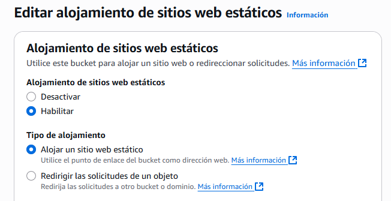

# Hospedar un sitio web estático (S3)
El objetivo de este proyecto es el hosting de un sitio web estático a través de la consola principal utilizando principalmente el servicio de S3.

## 1. Creación del bucket
Se crea un bucket con la configuración básica o por defecto. Se destacan las siguientes configuraciones:
- Bloquear todo el acceso público
  - Esta configuración bloqueará el acceso a todo público. Más allá de que hayan políticas establecidas que permitan el acceso, es un mecanismo para bloquear cualquier configuración existente y proteger el bucket de forma simple.
- Control de versiones de buckets
  - Esta opción es útil para poder versionar los cambios en el bucket (similar a git/github). En este caso dado que no tiene relevancia se deshabilita. Pero en un caso de uso real es altamente útil y necesario


## 2. Configuración como sitio web estático
Una vez creado el bucket S3 se configura el "alojamiento de sitios web estáticos". Se mantienen las configuraciones básicas, se destacan las siguientes configuraciones
- Documentos de error e índice
  - Se mantienen los nombres default "index.html" y "error.html"



### 3. Se agregan los archivos correspondientes
Se agregan los archivos html básicos para el sitio web estático


### 4. Configuración acceso público
Como se destacó en el paso (1) se bloqueó el acceso a todo publíco (De igual manera, por más que este deshabilitada la opción no existía tampoco una política de acceso establecida):


De esta manera, se deshabilita la opción y se configura una política de acceso abierta a todo público.
- Se utiliza el generador de políticas, por simplicidad.


La política generada fue la siguiente:

```json
{
  "Version": "2012-10-17",
  "Statement": [
    {
      "Sid": "Statement1",
      "Effect": "Allow",
      "Principal": "*",
      "Action": [
        "s3:GetObject"
      ],
      "Resource": "arn:aws:s3:::lgc-s3-estatico/*"
    }
  ]
}
```
- Efecto: Refiere al tipo de permiso, los que hay son allow/deny
- Principal: Refiere a quien aplica el permiso, en este caso a todos los usuarios
- Action: Representa el permiso en si mismo. En este caso getObject permite acceder a los "objetos" (asi se denominan a los archivos en este contexto de S3)
- Resource: Indica el recurso al cual aplica. Se especifica a través del ARN (Amazon Resource Name). Notar que luego del ARN se agrega el símbolo "*" (comodín o all) que refiere a todos los objetos del bucket.


Así finalmente puede accederse al bucket:


Y si se intenta algo inválido (Ej: url inválida):


## 5. Extensión con CloudFront

### 5.1 Creación de distribución cloud front
Se crea la distribución cloud frount. Se mantiene la configuración básica, entre las configuraciones más relevantes se destaca:
- Origen
  - Se selecciona el bucket S3 creado anteriormente
  - Se establece como ruta de origen el archivo "index.html"

- Seguridad
  - Se desactiva WAF, este firewall es útil para proteger adecuadamente el sistema, sin embargo dado que este caso es una simple prueba se desactiva (además tiene costos adicionales)


Finalmente el servicio de cloud front fue creado y pudo accederse a la web s3 estática correctamente (nótese el cambio de nombre de dominio porque ahora se encuentra por encima la capa de CloudFront por sobre el S3):


