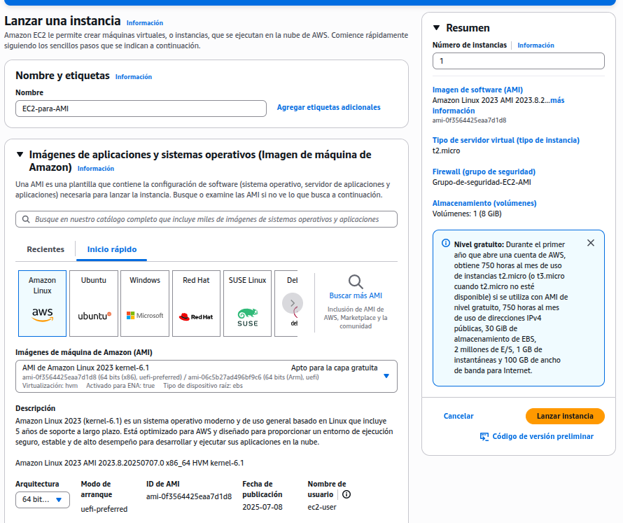

# EC2 duplicados con AMI y Load Balancer
Este proyecto consiste en la creación de una instancia EC2 que montara un servidor HTTP básico que luego será replicada creando imágenes a través del servicio AMI y posteriormente estas múltiples instancias serán gestionadas a través de un load balancer.

# Índice
[1. Creación de la instancia EC2](#1-creación-de-la-instancia-ec2)

&nbsp;&nbsp;&nbsp;&nbsp;[1.1 Creación de grupo de seguridad](#11-creación-de-grupo-de-seguridad)

&nbsp;&nbsp;&nbsp;&nbsp;[1.2 Configuración de la instancia para crear imagen](#12-configuración-de-la-instancia-para-crear-imagen)

[2. Creación de imagen con AMI](#2-creación-de-imagen-con-ami)

[3. Replicación de instancia con AMI](#3-replicación-de-instancia-con-ami)

[4. Creación del Load Balancer](#4-creación-del-load-balancer)

&nbsp;&nbsp;&nbsp;&nbsp;[4.1 Creación grupo destino](#41-creación-grupo-destino)

[5. Extensión CDK Java](#5-extensión-cdk-java)

## 1. Creación de la instancia EC2
Para la creación de la instancia EC2 se utilizarán los recursos básicos proporcionados por la "capa gratuita"
- Se utiliza imagen Amazon Linux
- Tipo de instacia t2.micro
- Se implementará un script inicial para que instale las dependencias necesarias para luego replicarlo a través de AMI
- Se elige un grupo de seguridad personalizado (se explicará más adelante)

### 1.1 Creación de grupo de seguridad
Los grupos de seguridad con firewalls para controlar las "conexiones" de entrada y de salida. En este caso a modo de práctica se define uno personalizado permitiendo cualquier salida y restringiendo la entrada a conexiones SSH y HTTP

### 1.2 Configuración de la instancia para crear imagen
Para configurar la máquina y luego replicarla a través de imágenes se ejecuta el siguiente script:
~~~bash
yum update -y
yum install -y httpd
systemctl start httpd
systemctl enable httpd
echo "<h1>Hola desde el EC2: $(hostname -f)</h1>" > /var/www/html/index.html
~~~

Esto script simplemente actualiza los paquetes e instala un servidor, que se iniciara siempre que la instancia este encendida. Luego se crea un index con la identificación de esta instancia. Para simplificar el acceso a la instancia se llevo a cabo a través de la consola, sin embargo podría realizarse por medio de una conexión SSH "manual" configurando claves para la instancia.

## 2. Creación de imagen con AMI
Se lleva a cabo la creación de una imagen a partir de la instancia creada anteriormente

## 3. Replicación de instancia con AMI
Teniendo la imagen creada, se crean 2 instancias adicionales. En cada nueva instancia se ejecuta el comando:
~~~bash
echo "<h1>Hola desde el EC2: $(hostname -f)</h1>" > /var/www/html/index.html
~~~
para poder diferenciar cada instancia al conectarse posteriormente a través del balanceador de carga

Nota: En todas las replicaciones se utilizó el grupo de seguridad creado anteriormente

## 4. Creación del Load Balancer
Entre las configuraciones más importantes se destacan:
- El balanceador es de tipo "aplicación" ya que se realiza el balance a nivel de redirección de las peticiones HTTP
- Se utilizó el grupo de seguridad creado anteriormente
- Se creo un grupo de destino con las diferentes instancias EC2

### 4.1 Creación grupo destino
Simplemente se configuro el grupo añadiendo todas las instancias y redirigiendo las peticiones hacia el puerto 80 (HTTP)

Finalmente se muestra un video con el funcionamiento del balanceador de carga

## 5. Extensión CDK Java
Para automatizar y poder replicar el trabajo realizado se implementa el correspondiente código al proyecto realizado.
En primer lugar, se configuran los diferentes elementos que van a componer a la instancia EC2:

~~~Java
Vpc vpc = Vpc.Builder.create(this, "Default-VPC")
        .subnetConfiguration(List.of(SubnetConfiguration.builder()
                .subnetType(SubnetType.PUBLIC)
                .name("Ingress")
                .build()
                )
        )
        .build();
vpc.applyRemovalPolicy(RemovalPolicy.DESTROY);
~~~
* Se crea una VPC (virtual private cloud) básica con la configuración por defecto, agregando que las subredes sean públicas para que la instancia tenga salida a Internet y pueda accederse
  
~~~Java
IMachineImage AMIFree = MachineImage.genericLinux(Map.of(
        "sa-east-1", "ami-0f3564425eaa7d1d8"
        )
    );

InstanceType t2Micro = InstanceType.of(InstanceClass.T2, InstanceSize.MICRO);
~~~
* Se define la imagen de la capa gratuita. Notar que la imagen especificada corresponde a la región de sao-paulo, en caso de querer desplegarse en otra región deberá agregarse su correspondiente imagen o cualquiera (esta en específico esta "fija" por ser de capa gratuita)
* Se utiliza el tipo de instancia t2.micro que corresponde a la capa gratuita

~~~Java
BlockDevice blockDevice = BlockDevice.builder()
        .deviceName("/dev/xvda")
        .volume(BlockDeviceVolume.ebs(
                16,
                EbsDeviceOptions.builder()
                .volumeType(EbsDeviceVolumeType.GP3)
                .build()
            )
        )
        .build();
~~~
* Se define el volumen raíz (EBS). Notar que el punto de montaje (deviceName) corresponde al path o ruta raíz específico para las imágenes de AmazonLinux por ello el valor fijo y específico. El resto las 16 GB y tipo de volumen GP3 son simplemente requisitos básicos.

~~~Java
SecurityGroup securityGroup = SecurityGroup.Builder.create(this, "custom-sg")
        .allowAllOutbound(Boolean.TRUE)
        .vpc(vpc)
        .build();
securityGroup.addIngressRule(Peer.anyIpv4(), Port.HTTP);
securityGroup.addIngressRule(Peer.anyIpv6(), Port.HTTP);
securityGroup.addIngressRule(Peer.anyIpv4(), Port.SSH);
securityGroup.addIngressRule(Peer.anyIpv6(), Port.SSH);
securityGroup.applyRemovalPolicy(RemovalPolicy.DESTROY);
~~~
* Se define un grupo de seguridad básico
  * Se habilitan como puertos de entrada a los protocolos HTTP y SSH. Y permitiendo cualquier IP
  * Se habilita como puerto de salida a cualquier puerto. Y permitiendo cualquier IP

~~~Java
UserData configScript = UserData.forLinux();
configScript.addCommands(
    "#!/bin/bash",
    "yum update -y",
    "yum install -y httpd",
    "systemctl start httpd",
    "systemctl enable httpd",
    "echo \"<h1>Hola desde el EC2: $(hostname -f)</h1>\" > /var/www/html/index.html"
);
~~~
* Se define un script básico que instala el servidor HTTP, lo inicia y crea un index.html con un mensaje que permite diferenciar las diferentes instancias

~~~Java
final int N = 3;
List<Instance> instances = IntStream.range(0, N)
        .mapToObj(i -> Instance.Builder.create(this, "Base-EC2-" + i)
                .machineImage(AMIFree)
                .instanceType(t2Micro)
                .blockDevices(List.of(blockDevice))
                .vpc(vpc)
                .securityGroup(securityGroup)
                .associatePublicIpAddress(Boolean.TRUE)
                .userData(configScript)
                .build()
        )
        .peek(instance -> instance.applyRemovalPolicy(RemovalPolicy.DESTROY))
        .toList();
~~~
* Finalmente se crean las instancias EC2, utilizando todos los elementos/configuraciones definidas anteriormente
* Notar que las instancias se almacenan en una lista
* Este procedimiento o resolución no reutiliza el primer EC2 para crear copias o imágenes a partir de ellas
  * Una alternativa más simple y práctica es la utilización de una única imagen (AMI) pasándole el script e incorporándola en un auto-scaling-group para luego asociarlo al load-balancer. Esta alternativa es a modo de práctica y sirve como ejemplo en el caso de querer incluir máquinas heterogéneas a un load-balancer

~~~Java
ApplicationLoadBalancer lb = ApplicationLoadBalancer.Builder.create(this, "LoadBalancer")
        .vpc(vpc)
        .internetFacing(Boolean.TRUE)
        .securityGroup(securityGroup)
        .build();
lb.applyRemovalPolicy(RemovalPolicy.DESTROY);

ApplicationListener listener = lb.addListener("HTTP-listener", BaseApplicationListenerProps.builder()
        .port(80)
        .open(Boolean.TRUE)
        .build()
);
listener.addTargets("Local-target-group", AddApplicationTargetsProps.builder()
        .port(80)
        .targets(
            instances.stream()
                .map(i -> new InstanceIdTarget(i.getInstanceId()))
                .toList()
        )
        .build()
);
~~~
* Se crea el load balancer
  * El método internetFacing habilita una dirección "ruteable" para que pueda accederse o enviarse peticiones a este
* Los listener son elementos que "escuchan o definen" que hacer respecto a la petición o llegada de un "mensaje" a determinado puerto, en este caso se define para el puerto 80 (HTTP)
  * Finalmente al listener se le agrega un "grupo objetivo o target" con todas las instancias a partir del ID de cada una. 
